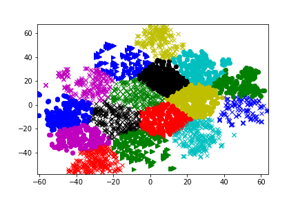

# 基于金庸小说用Word2Vec训练词向量
## 一、任务描述
    利用给定语料库（或者自选语料库），利用神经语言模型（如：Word2Vec,GloVe 等模型）来训练词向量，通过对词向量的聚类或者其他方法来验证词向量的有效性。
## 二、实验原理
作为轻量级神经网络，Word2Vec 模型包括输入层、隐藏层和输出层，主要分为CBOW 和Skip-gram 两种模型。其中，CBOW 模型在已知上下文$[w_{t-k},w_{t-k+1},...,w_{t+k}]$的情况下预测当前词$w_t$,其中滑动窗口的大小为$2k+1$,Skip-gram 模型在已知当前词$w_t$的情况下对上下文$[w_{t-k},w_{t-k+1},...,w_{t+k}]$进行预测。


    CBOW 模型示意图


    Skip-gram 模型示意图
## 三、实验步骤与结果
### 1. 文本预处理
    （1）去除文本特殊符号
    （2）加入专用词典，包括人名、武功、门派等专有名词
    （3）使用jieba分词对文本分词，并过滤掉停用词
```python
file_path_list = []
root_path = './dataset'
r1 = u'[a-zA-Z0-9’!"#$%&\'()*+,-./:：;<=>?「」@，。?★、…【】《》？“”‘’！[\\]^_`{|}~]+'
stopwords = [line.strip() for line in open('stopwords.txt',encoding='UTF-8').readlines()]
for file in os.listdir(root_path):
    file_path_list.append(os.path.join(root_path, file))
print(file_path_list)

output_file = open("corpus.txt", 'w', encoding='utf-8')
for i,file_path in enumerate(file_path_list):
    with open(file_path,encoding="ANSI") as f:
        corpus=[]
        text = f.read()[40:]
        text = re.sub(r1, '', text)
        text = text.replace("\n", '')
        text = text.replace("\u3000", '')
        text = text.replace(" ", '')
        jieba.load_userdict("./proper_dict.txt")
        jieba_text = jieba.lcut(text)
        for j,word in enumerate(jieba_text):
            if word not in stopwords and len(word) > 1:
                corpus.append(word)
        output_file.writelines(' '.join(corpus))
        output_file.write('\n')
output_file.close()
```
### 2. 训练词向量并验证
（1）使用gensim训练词向量，这里我们设置vector_size=300,  min_count=10, window=10, epochs=10

（2）输入一些名词，查看训练结果

    与张无忌最相关的词语为 [('赵敏', 0.8115577101707458), ('周芷若', 0.7417915463447571), ('杨逍', 0.6835538744926453), ('小昭', 0.6577381491661072), ('韦一笑', 0.6495222449302673), ('金花婆婆', 0.6473484039306641), ('蛛儿', 0.5936452150344849), ('常遇春', 0.5892216563224792), ('赵姑娘', 0.5611370205879211), ('范遥', 0.5592136383056641)]
    与葵花宝典最相关的词语为 [('宝典', 0.8971998691558838), ('正邪', 0.8577531576156616), ('强身健体', 0.8367770314216614), ('至高无上', 0.8340772390365601), ('研习', 0.829169750213623), ('二十五年', 0.8260507583618164), ('心血', 0.8253218531608582), ('博大精深', 0.8238565325737), ('传下来', 0.8237099051475525), ('上代', 0.8218773603439331)]
    与令狐冲最相关的词语为 [('岳不群', 0.6559924483299255), ('盈盈', 0.65257328748703), ('田伯光', 0.6495348215103149), ('岳夫人', 0.5618121027946472), ('令狐冲心', 0.5542599558830261), ('仪琳', 0.550065279006958), ('恒山派', 0.5389837026596069), ('令狐冲见', 0.49998170137405396), ('华山派', 0.4980582892894745), ('令狐冲喜', 0.49091073870658875)]
    与东方不败最相关的词语为 [('教主', 0.8040623068809509), ('杨莲亭', 0.8024854063987732), ('任我行', 0.7789594531059265), ('童百熊', 0.7646351456642151), ('殷锦', 0.7274211049079895), ('韩千叶', 0.7242145538330078), ('日月神教', 0.7201359272003174), ('杨逍', 0.7176946997642517), ('宝训', 0.703029215335846), ('许雪亭', 0.702549159526825)]
    与杨过最相关的词语为 [('小龙女', 0.7767677307128906), ('金轮法王', 0.6239429116249084), ('法王', 0.6072250008583069), ('杨过心', 0.6041133999824524), ('郭襄', 0.60128253698349), ('郭芙', 0.5980198979377747), ('李莫愁', 0.5736259818077087), ('神雕', 0.5553303360939026), ('神雕侠侣', 0.5496136546134949), ('裘千尺', 0.5434780716896057)]

（3）结果分析：通过实验，输入张无忌，我们得到最相关的词语为赵敏、周芷若、杨逍、小昭；输入令狐冲，我们得到得到最相关的词语为岳不群、盈盈、田伯光、岳夫人。这与我们对于金庸小说的认知是相符合的。
但是，我们还发现有令狐冲心、令狐冲喜等词语，这可能是jieba分词时所产生的错误。实验效果整体较好，但是存在分词不完善的问题。
```python
sentences = word2vec.LineSentence("corpus.txt")
model = gensim.models.Word2Vec(sentences, vector_size=300,  min_count=10, window=10, epochs=10,workers=16)  
model.wv.save_word2vec_format("./word2Vec"+ ".bin", binary=True) 
wordVec = gensim.models.KeyedVectors.load_word2vec_format("word2Vec.bin", binary=True)

list= ['张无忌','葵花宝典','令狐冲','东方不败','杨过']
for i in range(len(list)):
    print("与"+list[i]+"最相关的词语为",wordVec.most_similar(list[i]))
```

### 3.聚类验证
    （1）统计高频词语（频次大于100）
    （2）进行Kmeans聚类，得到结果图


通过观察上述结果图，我们发现聚类效果较好，说明词向量相关性训练较好
